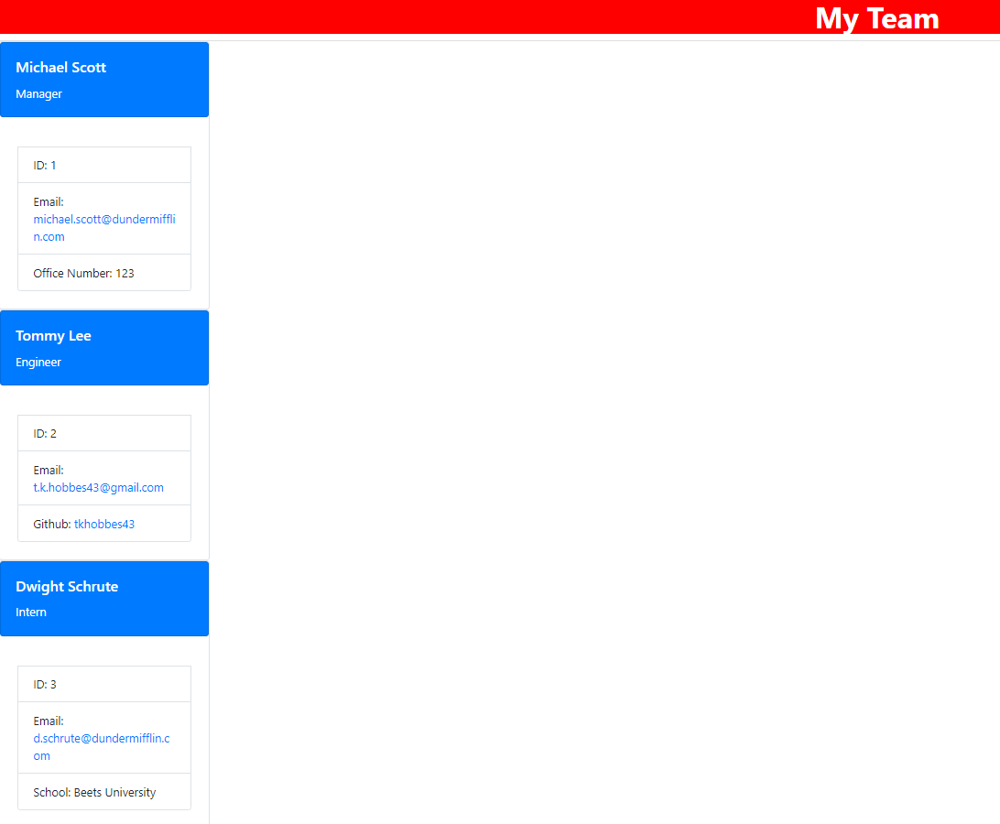

<h1 align="center"> Team Profile Generator </h1>


## Description

This is a Node.js command-line app that will take in information about employees on a software engineering team: manager, engineers, and interns, then dynamically generates an HTML webpage that displays summaries for each of these people.

## Table of Contents
- [Description](#description)
- [Acceptance Criteria](#acceptancecriteria)
- [Installation](#installation)
- [Usage](#usage)
- [Tests](#tests)
- [Questions](#questions)

## Acceptance Criteria
```
GIVEN a command-line application that accepts user input
WHEN I am prompted for my team members and their information
THEN an HTML file is generated that displays a nicely formatted team roster based on user input
WHEN I click on an email address in the HTML
THEN my default email program opens and populates the TO field of the email with the address
WHEN I click on the GitHub username
THEN that GitHub profile opens in a new tab
WHEN I start the application
THEN I am prompted to enter the team manager’s name, employee ID, email address, and office number
WHEN I enter the team manager’s name, employee ID, email address, and office number
THEN I am presented with a menu with the option to add an engineer or an intern or to finish building my team
WHEN I select the engineer option
THEN I am prompted to enter the engineer’s name, ID, email, and GitHub username, and I am taken back to the menu
WHEN I select the intern option
THEN I am prompted to enter the intern’s name, ID, email, and school, and I am taken back to the menu
WHEN I decide to finish building my team
THEN I exit the application, and the HTML is generated
```

## Installation
This will require Node.js as well as npm packages Jest and Inquirer.This app will be invoked by using the `node index.js` command.

## Usage
Use inquirer from you command line to answer all of the questions about who is participating in your project.  Please see the below video walkthrough below.
[Walkthrough Video](https://drive.google.com/file/d/1b30C6G612l0aFkmz4ycoqjO7F48KyXZZ/view)



## Tests
Jest was used for this app.  To run the test, it will be invoked by being in the direct after having downloaded Jest from npm and then using the command `npm run test`. 

## Questions
For any questions or concerns, contact me at either my [GitHub](https://github.com/tkhobbes43)
or my email: t.k.hobbes43@gmail.com
